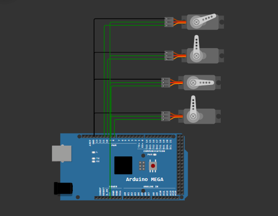

# Arduino Mega Robotic Arm

This repository contains the circuit diagram and Arduino code for controlling a robotic arm with four servo motors. The robotic arm is designed for both manual and automated operation, making it suitable for industrial and hobbyist applications.

---

## Features
- **Four Servo Motors**:
  - **Base Rotation**: Controls the rotation of the arm's base.
  - **Arm Height Adjustment**: Moves the arm up or down.
  - **Grip Angle**: Adjusts the angle of the gripper.
  - **Gripper Open/Close**: Allows the arm to grab or release objects.
- **Manual Control**: Use the Serial Monitor to send commands for precise movement of individual servos.
- **Automated Sequence**: Perform a pre-programmed sequence of movements with a single command.
- **Smooth Motion**: Gradual angle adjustment ensures precise and realistic movements.

---

## Components
1. **Arduino Mega 2560**
2. **4 x Servo Motors** (e.g., SG90, MG996R, or similar)
3. **External Power Supply** (recommended for high-torque servos)
4. **Jumper Wires**
5. **Breadboard** (optional, for power distribution)

---

## Circuit Diagram
The diagram below shows how the servo motors are connected to the Arduino Mega. 



### Servo Pin Connections
- **Servo 1 (Base Rotation)**: Pin 8
- **Servo 2 (Arm Height Adjustment)**: Pin 9
- **Servo 3 (Grip Angle)**: Pin 10
- **Servo 4 (Gripper Open/Close)**: Pin 11

### Notes
- Ensure all GND connections are properly linked.
- Use an external power source if the servos draw more current than the Arduino can provide.

---

## Code
This project includes an Arduino sketch that allows you to control the robotic arm either manually or through an automated sequence. 

### Key Features of the Code
1. **Manual Control**: Send commands via the Serial Monitor to control individual servos.
2. **Automated Sequence**: Execute a pre-programmed series of movements with delays.
3. **Angle Constraints**: Each servo has defined angle limits to prevent damage.

Upload the following code to your Arduino Mega using the Arduino IDE:

```cpp
#include <Servo.h>

// Create servo objects
Servo servo1;  // Base rotation
Servo servo2;  // Arm height
Servo servo3;  // Grip angle
Servo servo4;  // Gripper

// Define servo pins
const int SERVO1_PIN = 8;
const int SERVO2_PIN = 9;
const int SERVO3_PIN = 10;
const int SERVO4_PIN = 11;

// Define optimized servo angle limits
const struct {
    int min;
    int max;
    int default_pos;  // Default starting position
} servoLimits[] = {
    {0, 130, 0},     // Servo 1 (Base): Full rotation
    {90, 180, 90},   // Servo 2 (Lift): Optimized for lifting
    {0, 120, 0},    // Servo 3 (Grip angle): Common gripping angles
    {70, 125, 70}     // Servo 4 (Gripper): 70=open, 100=closed
};

// Servo control variables
struct ServoControl {
    int currentAngle;
    int targetAngle;
    unsigned long lastMoveTime;
};

ServoControl servos[4];

// Movement settings
const int MOVE_INTERVAL = 30;    // Time between moves in milliseconds
const int ANGLE_STEP = 3;        // Degrees to move per step

// Auto movement variables
bool autoMoveActive = false;
int currentStep = 0;
unsigned long stepStartTime = 0;
const int STEP_DELAY = 1000;  // Delay between steps in milliseconds

// Define the automated sequence
const struct {
    int servo;
    int angle;
} autoSequence[] = {
    {4, 70},   // Step 0
    {2, 80},   // Step 1
    {3, 0},    // Step 2
    {1, 28},   // Step 3
    {2, 180},  // Step 4
    {4, 125},  // Step 5
    {3, 85},   // Step 6
    {2, 104},  // Step 7
    {1, 100},  // Step 8
    {2, 158},  // Step 9
    {3, 24},   // Step 10
    {4, 70}   // Step 11
};

const int SEQUENCE_LENGTH = sizeof(autoSequence) / sizeof(autoSequence[0]);

void setup() {
    Serial.begin(9600);
    
    // Initialize servos
    servo1.attach(SERVO1_PIN);
    servo2.attach(SERVO2_PIN);
    servo3.attach(SERVO3_PIN);
    servo4.attach(SERVO4_PIN);
    
    // Set initial positions to defaults
    for (int i = 0; i < 4; i++) {
        servos[i].currentAngle = servoLimits[i].default_pos;
        servos[i].targetAngle = servoLimits[i].default_pos;
        servos[i].lastMoveTime = 0;
    }
    
    // Move servos to initial positions
    servo1.write(servos[0].currentAngle);
    servo2.write(servos[1].currentAngle);
    servo3.write(servos[2].currentAngle);
    servo4.write(servos[3].currentAngle);
    
    Serial.println("Robotic Arm Ready!");
    Serial.println("Send commands:");
    Serial.println("- servo_number,angle");
    Serial.println("- autoMove (for automated sequence)");
}

void loop() {
    // Check for serial commands
    if (Serial.available() > 0) {
        String input = Serial.readStringUntil('\n');
        if (input == "autoMove") {
            startAutoMove();
        } else {
            parseCommand(input);
        }
    }
    
    // Update servo positions
    unsigned long currentTime = millis();
    updateServos(currentTime);
    
    // Handle auto movement sequence
    if (autoMoveActive) {
        updateAutoMove(currentTime);
    }
}

void startAutoMove() {
    autoMoveActive = true;
    currentStep = 0;
    stepStartTime = millis();
    Serial.println("Starting automated sequence");
    
    // Set first movement
    int servoIndex = autoSequence[currentStep].servo - 1;
    servos[servoIndex].targetAngle = autoSequence[currentStep].angle;
}

void updateAutoMove(unsigned long currentTime) {
    // Check if all servos have reached their target positions
    bool allServosDone = true;
    for (int i = 0; i < 4; i++) {
        if (servos[i].currentAngle != servos[i].targetAngle) {
            allServosDone = false;
            break;
        }
    }
    
    // If current movement is complete and delay time has passed
    if (allServosDone && (currentTime - stepStartTime >= STEP_DELAY)) {
        currentStep++;
        
        // Check if sequence is complete
        if (currentStep >= SEQUENCE_LENGTH) {
            autoMoveActive = false;
            Serial.println("Automated sequence complete");
            return;
        }
        
        // Start next movement
        int servoIndex = autoSequence[currentStep].servo - 1;
        servos[servoIndex].targetAngle = autoSequence[currentStep].angle;
        stepStartTime = currentTime;
        
        Serial.print("Step ");
        Serial.print(currentStep);
        Serial.print(": Moving servo ");
        Serial.print(autoSequence[currentStep].servo);
        Serial.print(" to ");
        Serial.println(autoSequence[currentStep].angle);
    }
}

void parseCommand(String command) {
    int commaIndex = command.indexOf(',');
    if (commaIndex == -1) {
        Serial.println("Invalid command! Use format: servo_number,angle");
        return;
    }
    
    // Extract servo number and target angle
    int servoNum = command.substring(0, commaIndex).toInt() - 1;
    int angle = command.substring(commaIndex + 1).toInt();
    
    // Validate servo number
    if (servoNum < 0 || servoNum > 3) {
        Serial.println("Invalid servo number! Use 1-4");
        return;
    }
    
    // Constrain angle to valid range
    angle = constrain(angle, servoLimits[servoNum].min, servoLimits[servoNum].max);
    
    // Set new target angle
    servos[servoNum].targetAngle = angle;
    
    Serial.print("Moving servo ");
    Serial.print(servoNum + 1);
    Serial.print(" to ");
    Serial.println(angle);
}

void updateServos(unsigned long currentTime) {
    Servo* servoArray[] = {&servo1, &servo2, &servo3, &servo4};
    
    for (int i = 0; i < 4; i++) {
        if (currentTime - servos[i].lastMoveTime >= MOVE_INTERVAL) {
            if (servos[i].currentAngle != servos[i].targetAngle) {
                // Determine direction and move one step
                if (servos[i].currentAngle < servos[i].targetAngle) {
                    servos[i].currentAngle = min(servos[i].currentAngle + ANGLE_STEP, 
                                               servos[i].targetAngle);
                } else {
                    servos[i].currentAngle = max(servos[i].currentAngle - ANGLE_STEP, 
                                               servos[i].targetAngle);
                }
                
                servoArray[i]->write(servos[i].currentAngle);
                servos[i].lastMoveTime = currentTime;
            }
        }
    }
}
